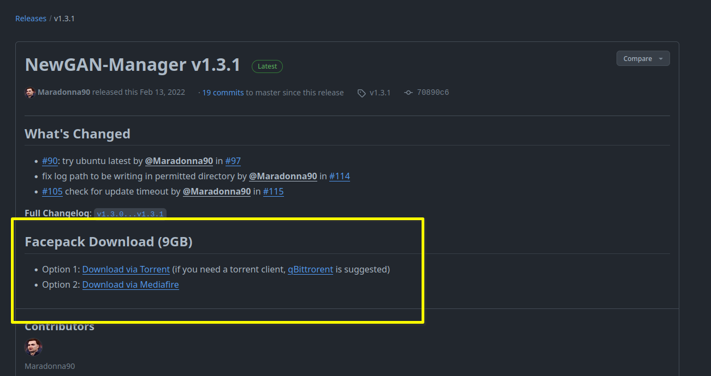

# Jaqen

A Football Manager New GAN Manager rewrite in go. The original could be found [here](https://github.com/Maradonna90/NewGAN-Manager).

I named it Jaqen based on Jaqen H'ghar having a wall of faces.

**This is not supported for Football Manager 2024!**

> There is a change in the code where the id now has a `r-` prefix in front of the UIDs, I may get to it one day *shrug*. In the meantime you may be able to work around it through this video https://www.youtube.com/watch?v=ZhuVzb_7PZY

## Motivation

I just wanted to learn go and just found the original didn't run well on Linux, as I think the original version works pretty well for Windows and Mac. However, this is just a fun side project for me. Even if I finish this off to a level I could accept, I don't intend on supporting it long term, you're very welcomed to submit PRs and Issues but I don't guarantee to fix/review it.

Could I have just found a way to fix the Linux CI on that project? I tried fixing it again with by updating a few dependencies (such as breifcase) added some configs needed in the TOML file, but haven't got it working yet.

## Usage

> Replace all the CAPITALIZE_SNAKE_CASE with your own names, ex. `RTF_FILE_NAME` could be whatever you named the rtf file like: newgen.rtf

In this game, all user modded graphics are placed under a `graphics/` folder. The graphics folder path might look something like this: `$HOME/.local/share/Steam/steamapps/compatdata/ID_NUMBER/pfx/drive_c/users/steamuser/Documents/Sports Interactive/Football Manager FM_VERSION/graphics`, the `graphics/` folder might not be existant and you may have to create your own. 

1. Download the New GAN face pack and place it in the graphics folder. The latest facepack could be found at the original [NewGAN-Manager release page](https://github.com/Maradonna90/NewGAN-Manager/releases) and would be under `Facepack Download`. Like this 
2. Extract the file and the folder should have subfolders titled: `EECA`, `MESA` etc...
3. Copy the `config.xml` file (under `example`) to the Facepack folder
4. Generate the `.rtf` file needed, name it `newgen.rtf` and place it in the Facepack folder. If you don't know how to do it, watch [Zealand's video on the original NEWGan Manager](https://www.youtube.com/watch?v=pmdIkhfmY6w), the steps are between `9:28` to `12:28`
5. Compile the binary by running `go build .` and place the binary inside the Facepack folder
6. Execute the binary
7. Reload the skin and enjoy.

## Future Wants

This is just some notes on what I want it to do in the future.

- Support FM2024 having the `r-` thing in front of the UID, potentially with a flag
- Build a GUI, maybe with Go Wails?
- The ability to execute the binary in a different directory